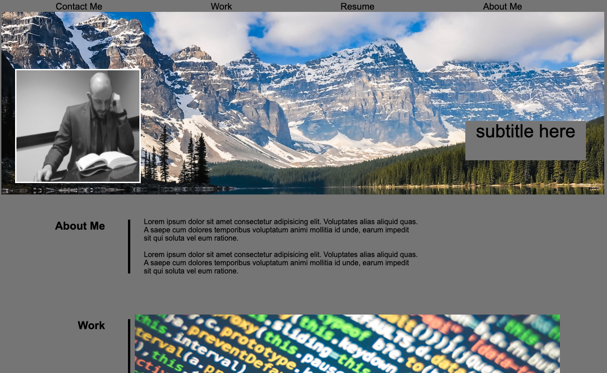

# KJSPortfolio

Portfolio Homework

This repository is a portfolio that leads employers to the work I have created.

1. Links in navbar scroll to sections when clicked.
2. Attached several social media and "contact me" links.
3. Includes recent photo of myself along with intentionally added photos and comments that will be updated with more personal info as the course continues.
4. When seen on other devices, the screen will change in order to keep from becoming too pixelated.

Below, find attached links to Github repository and deployed finished project.

[Live link to site](https://kylejames20.github.io/KJSPortfolio/)